# Deploying GPT-J with DeepSpeed on AWS Sagemaker

This repository demonstrates how you can accelerate GPT-J with DeepSpeed Inference and deploy it on AWS SageMaker.

## LLM Model Size Grows Exponentially  

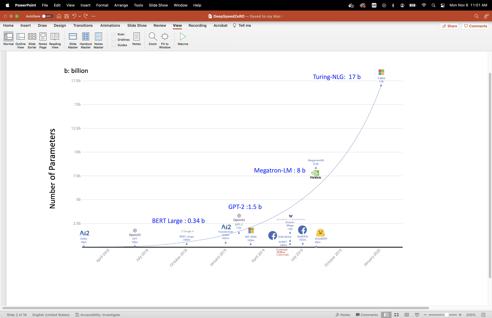

## DeepSpeefd ZeRO (Zero Redundancy Optimization)

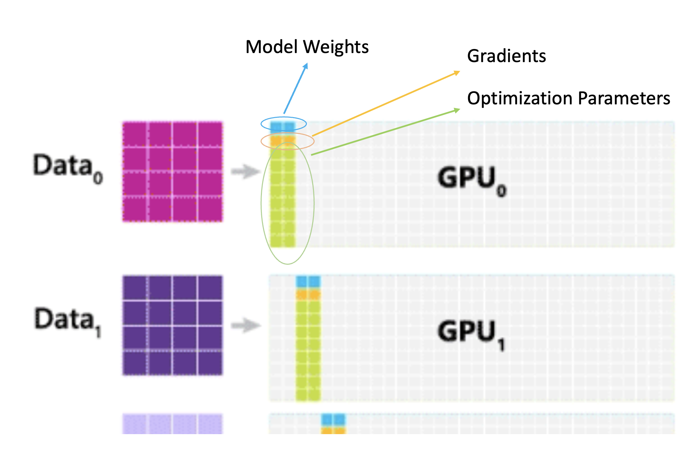
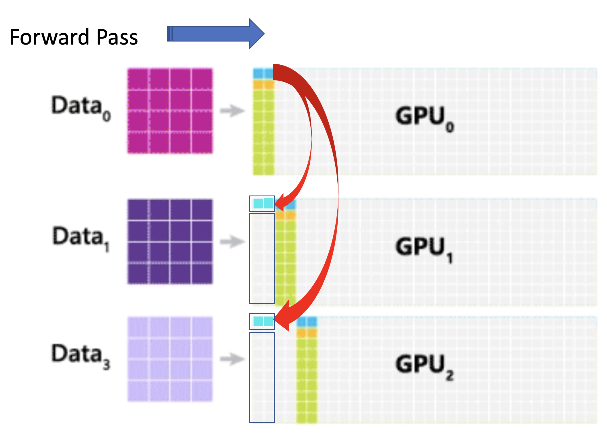
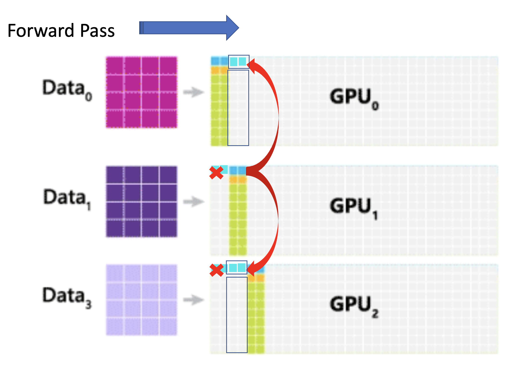
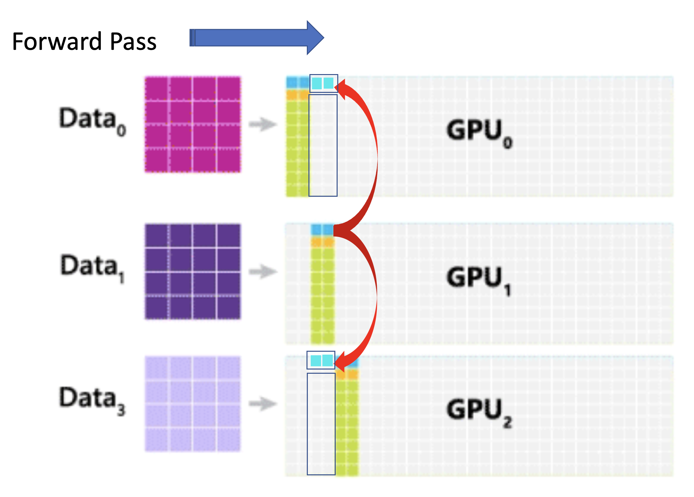
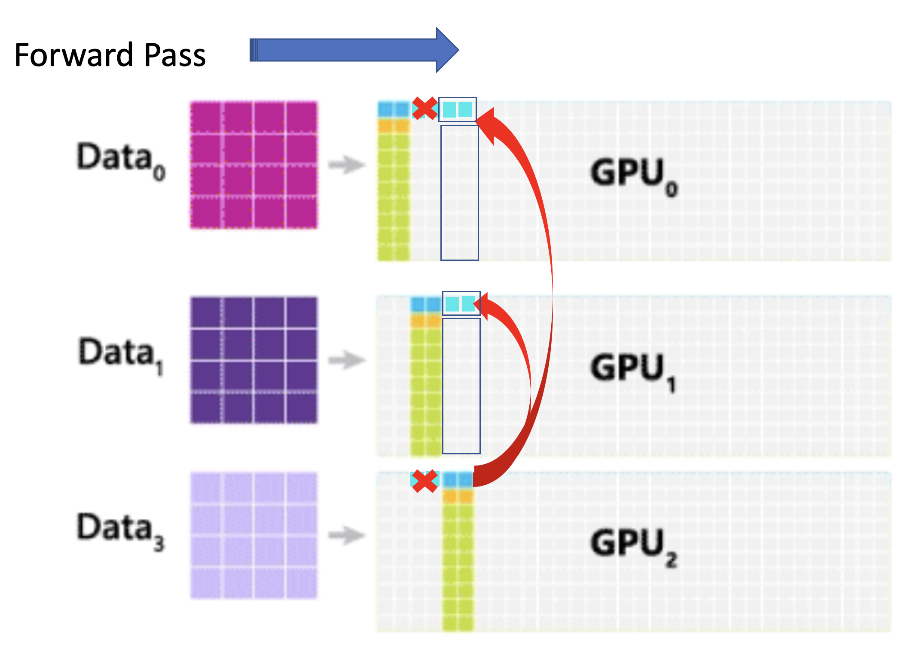

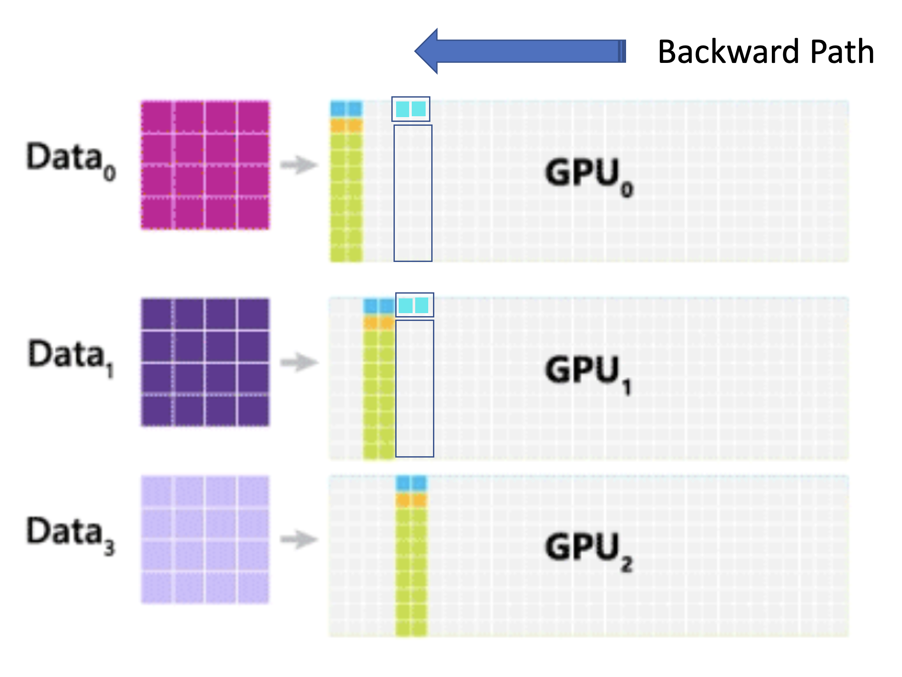
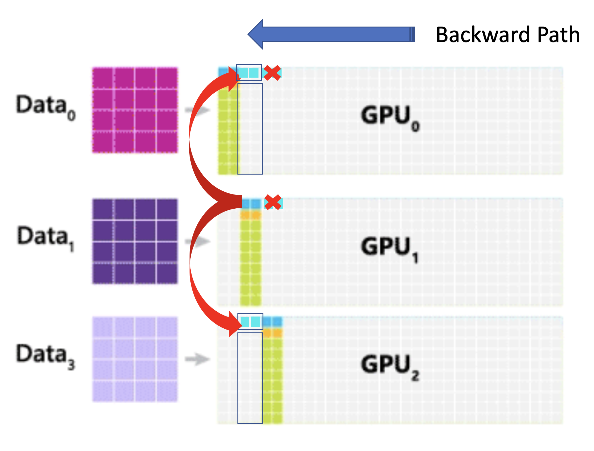

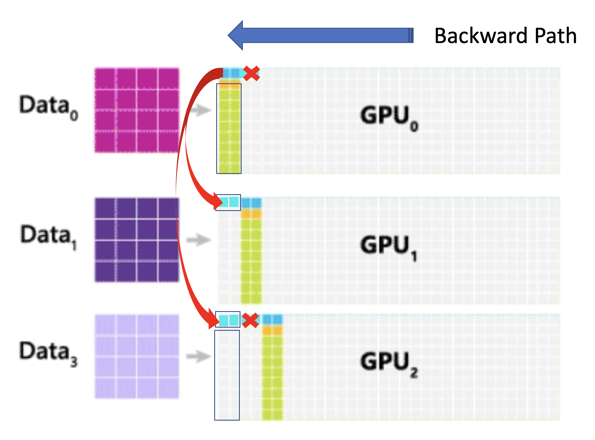
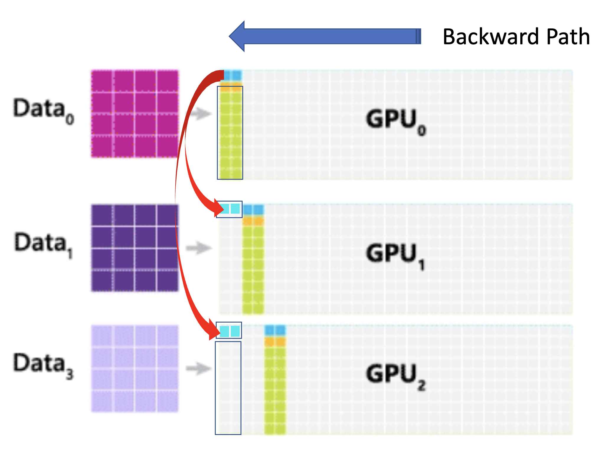
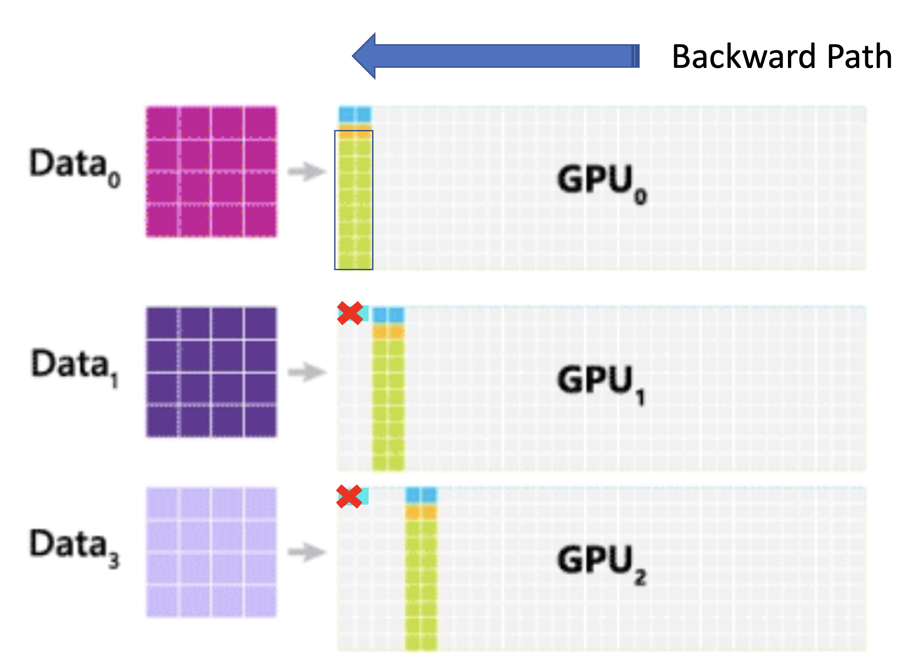
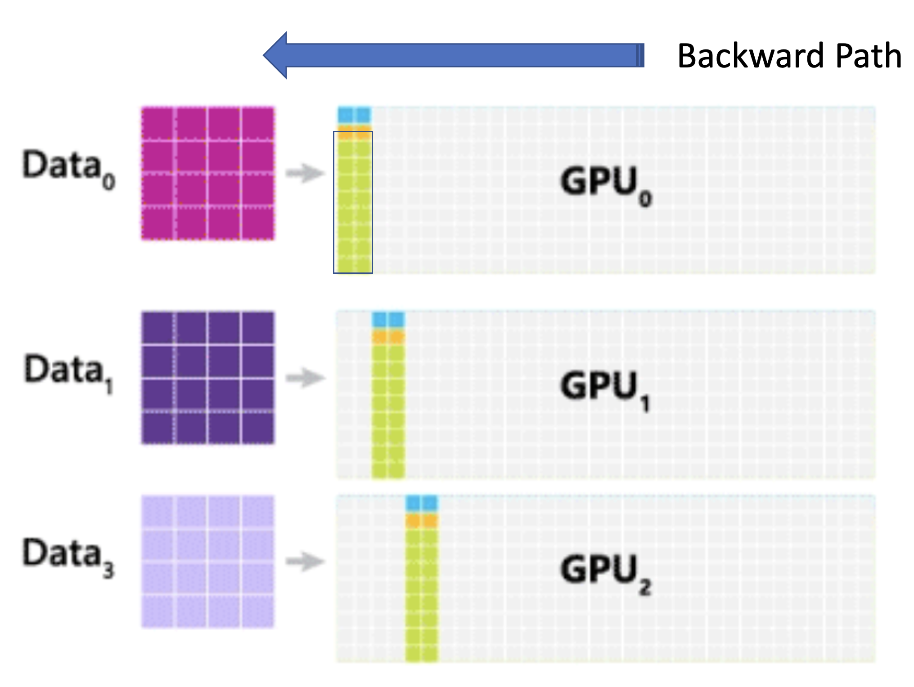
